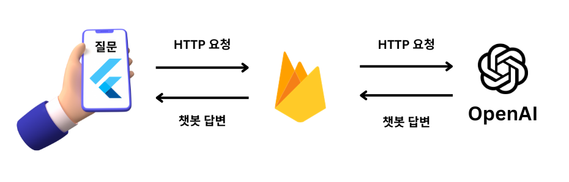
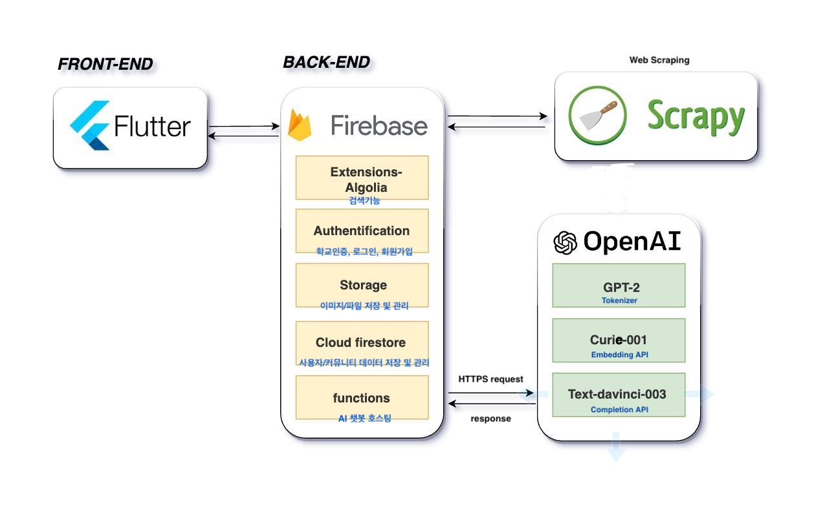
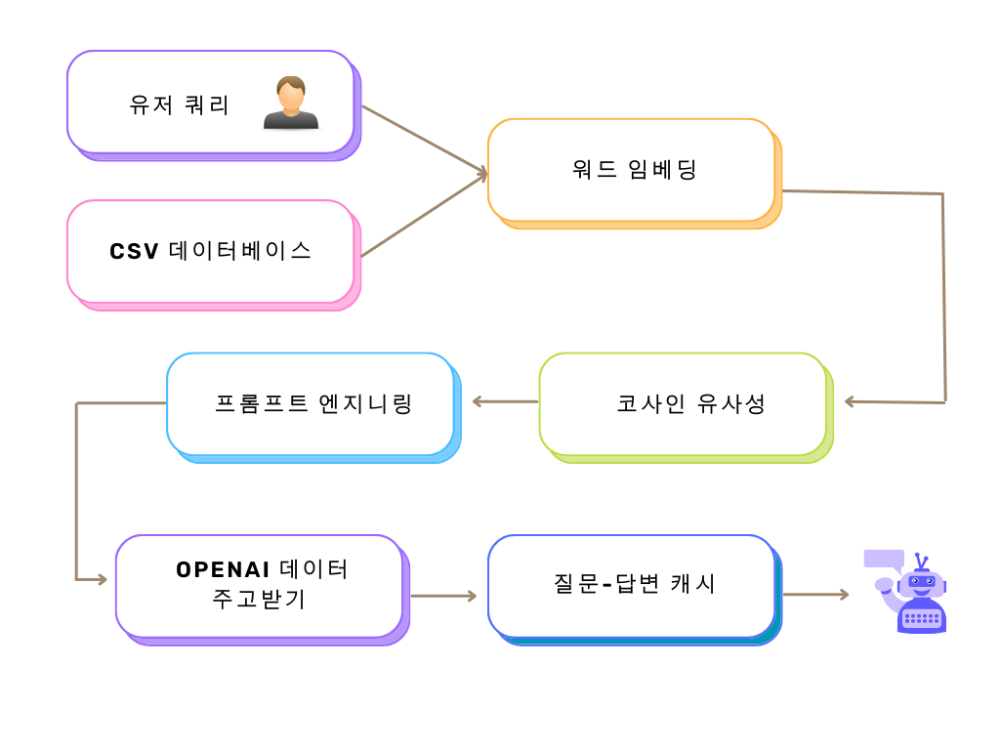
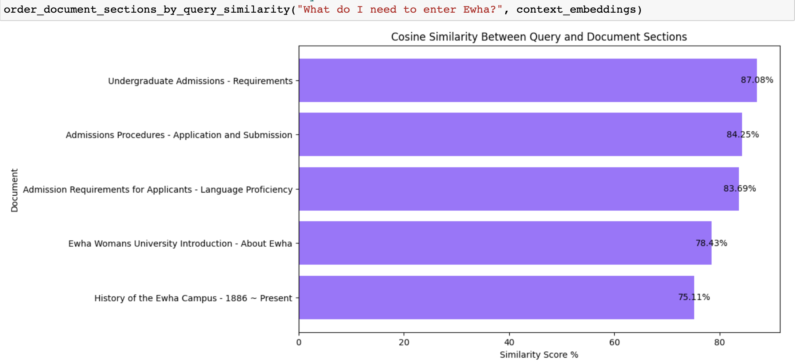

# Studentia **Chatbot & Integration**

Welcome to the final version of Studentia Chatbot GitHub repository! This project is a close-domain Q&A chatbot designed to answer questions about Ewha Womans University. The chatbot is integrated into a Flutter app using Firebase Functions, ensuring secure communication through HTTPS requests.

https://github.com/Studentia/Studentia-Chatbot/assets/86768892/aa06e986-39b2-483d-9287-8cdf5d5c76f8

## **Table of Contents**

1. Introduction
2. Tech Stack
3. System Architecture
4. Source Code Explanations: How to Build
5. Cosine Similarity Results
6. Why We Use This Model
7. How To Test & Install
8. Conclusion
9. References

## **Introduction**

This repository contains the source code for a close-domain Q&A chatbot tailored for Ewha Womans University. The chatbot is integrated into a Flutter app using Firebase Functions for secure communication.



## **Tech Stack**

| Technology | Name | Details |
| --- | --- | --- |
| Firebase  | Functions | Hosting |
| OpenAI API | Embedding APIs | text-curie-search-query-001 for embedding the user’s query |
|  |  | text-curie-search-doc-001 for embedding the database’s content |
|  | Completions API | text-davinci-003 for better English linguistic understanding |
| Transformers | Tokenizer | GPT-2 Tokenizer to count the tokens of a text |
| Python | 3.11v | Development |
|  | Pandas | Data Processing |
|  | NumPy | Cosine Similarity |

## **System Architecture**

The chatbot's system architecture involves a Firebase Functions setup, handling HTTPS requests, and communicating with the OpenAI API for generating responses.





## Source Code Explanations: How To Build

The Studentia Chatbot operates through a series of steps, providing accurate and context-aware responses to user queries:

**1. Database Preparation**

- The Ewha Womans University database is created, tokenized with GPT-2, and embedded using the 'text-curie-search-doc-001' model. (See in [Studentia-Chatbot-Test repository](https://github.com/Studentia/Studentia-Chatbot-Test) )
- The resulting document embeddings are stored for efficient retrieval.
    
    
    
    
    

**2. User Query Processing**

- When a user query is received, the system checks if the question is cached in the Firebase database.
    
    ```dart
    //chatbot_page.dart
    final querySnapshot = await _firestore
            .collection('chatbot')
            .where('userMessage', isEqualTo: prompt)
            .limit(1)
            .get();
    ```
    
- If cached, the stored answer is provided directly, eliminating the need for an OpenAI API call.

**3. Context Retrieval and Similarity Calculation**

- If the query is not cached, the system does an HTTPS request to Firebase Functions and proceeds to embed the query using 'text-search-curie-query-001'.
    
    ```python
    #chatbot_logic.py
    def get_embedding(text: str) -> List[float]:
        result = openai.Embedding.create(
            model="text-search-curie-query-001",
            input=text
        )
        return result["data"][0]["embedding"]
    
    def get_query_embedding(text: str) -> List[float]:
        return get_embedding(text)
    ```
    
- Cosine similarity is calculated between the query embedding and document embeddings to find the most similar documents.
    
    ```python
    #chatbot_logic.py
    def vector_similarity(x: List[float], y: List[float]) -> float:
        return np.dot(np.array(x), np.array(y))
    ```
    

**4. Prompt Engineering**

- The most relevant document is selected, and a prompt is constructed for the 'text-davinci-003' Completions API.
    
    ```python
    #chatbot_logic.py
    def construct_prompt(question: str) -> str:
        most_relevant_document_sections = order_document_sections_by_query_similarity(question, document_embeddings)
    ```
    
- The prompt instructs the system to answer the question truthfully using the provided context.
    
    ```python
    """Answer the question as truthfully as possible using the provided context, and if the answer is not undoubtedly contained within the text below, absolutely don't answer anything except for saying "Sorry, I don't have that information. Please visit Ewha Womans University official website at https://www.ewha.ac.kr/ewhaen/index.do for more information."\n\nContext:\n"""
    ```
    

**5. Completions API Call**

- The constructed prompt is passed to the 'text-davinci-003' Completions API to generate a linguistically refined answer.
    
    ```python
    #main.py
    custom_prompt = req.data.decode('utf-8') 
    prompt = construct_prompt(custom_prompt)
    
    response = openai.Completion.create(
        engine="text-davinci-003",
        prompt=prompt,
        max_tokens=70,
    )
    ```
    

**6. Cache Update and Response Delivery**

- The generated query and answer pair are stored in cache for future reference.
    
    ```dart
    //chatbot_page.dart
    await _firestore.collection('chatbot').add({
              'userMessage': prompt,
              'chatbotMessage': response.body.trim(),
            });
    ```
    
- The refined answer is sent to the Flutter app for presentation to the user.
    
    ```python
    #main.py
    generated_text = response.choices[0].text
    
    return https_fn.Response(generated_text)
    ```
    

### Files referenced:

### **`main.py`**

This file handles the HTTP request to the Firebase Function and utilizes the **`chatbot_logic`** module to generate responses based on user queries.

### **`chatbot_logic.py`**

- Loads the Ewha Womans University database.
- Utilizes OpenAI API for embedding and similarity computations.
- Implements functions for vector similarity, query embeddings, and constructing prompts for the chatbot.

### **`requirements.txt`**

Specifies the required Python packages for the project, including Firebase Functions, OpenAI, NumPy, Pandas, and Transformers. 

### **`chatbot_page.dart`**

Makes API requests to and from the flutter side to firebase functions. Integrates the chatbot's backend with the app's frontend.

## **Cosine Similarity Results**

A graph displaying the cosine similarity results is included to visualize the relevance of document sections to user queries and how well the chatbot is able to identify and prepare an appropiate answer to the user’s query.



## **Why We Use This Model**

- Advanced Language Mode
- Easy Integration
- Versatile Prompt Customization
- Scalability for Growing
- Portability
- Trusted by Developers

## How To Test & Install

To test and install this chatbot you may refer to the following repositories:

- How To Test: Studentia-Chatbot-Test
- How To Install: Studentia

## **Conclusion**

We introduced the Studentia Chatbot: An innovative solution designed to be an information-seeking tool for international students at Ewha Womans University. We hope to make the lives of fellow foreign students in Korea a bit better and enjoyable. With secure communication powered by Firebase Functions and response accuracy elevated by the OpenAI model, we believe Studentia is on its way to become a valuable companion for navigating university-related queries.

## **References**

- [Firebase Functions](https://github.com/firebase/firebase-functions)
- [OpenAI Python API](https://github.com/openai/openai)
- **[Building a Custom GPT-3 Q&A Bot Using Embeddings by Peter Foy](https://www.mlq.ai/fine-tuning-gpt-3-question-answer-bot/)**
